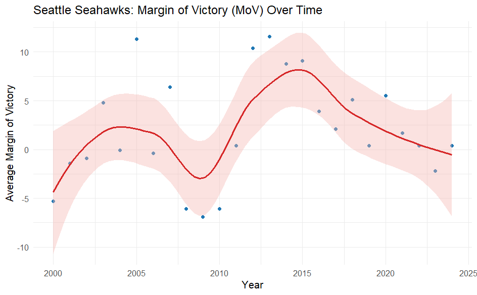
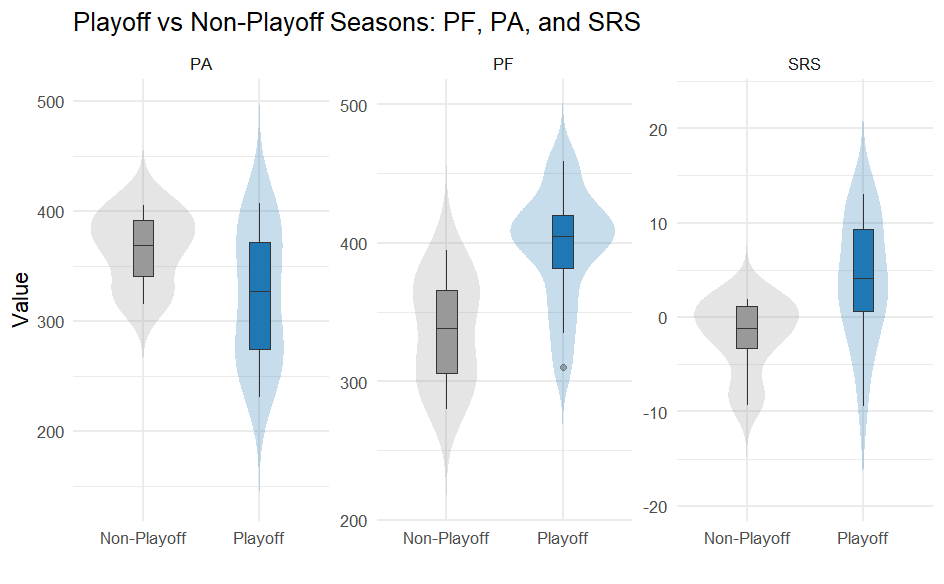

# Analysis of the Seattle Seahawks from 2000-2024

### Kelly Arriaza


## Introduction
The goal of this project is to explore the data set to analyze the performance of
the Seattle Seahawks from 2000–2024. This analysis can be used to understand how
key performance metrics influence the team’s chances of making the playoffs and
identify patterns that could inform future success.

The questions in this analysis include:

1. Has the Margin of Victory (MoV) improve or decline over the years?

2. How do playoff seasons differ from non-playoff seasons in terms of PF, PA, and SRS?

These will be the main questions answered and show how offensive strength, 
defensive consistency, and overall team quality (SRS) correlate with playoff 
likelihood, providing insights into what factors matter most for future performance.

## Data
### Structure
The link to the data set is 
https://www.pro-football-reference.com/teams/sea/index.htm. This website 
includes season statistics of the Seattle Seahawks from 1976-2025. In creating
the data set, I decided for the range to be 2000-2024 to see more recent data and
excluded 2025 as the season is ongoing and is not complete.


### Cleaning
There were also a few columns that I removed due to lack of relevancy in the
website where the data came from as it had a way to be be able to remove variables.
These variables are "Team","League", and "Coach". The information is "Team" and 
"League"were the exact same for all the seasons as it is for the Seahawks in the 
National Football League (NFL). I also excluded "Coach" because I did not see any
relevance for the questions I wanted to ask. 

In R, the first thing was to read in the text file and made sure that all column
names are unique. After taking a look at the names of the columns, I decided that
AV, Passer, Rusher, and Receiver were also not relevant to the questions as I am
looking for overall team stats, not individual. Also changed the name of Points
and Columns for more clarification on data.

```r
df <- read_csv(
  "seahawks",
  skip = 1,                  
  na = c("", "NA"),          
  trim_ws = TRUE             
)

names(df) <- make.names(names(df), unique = TRUE)

df <- df %>%
  rename(
    Pts_Off  = `Pts...14`,
    Yds_Off  = `Yds...15`,
    Pts_Def  = `Pts...16`,
    Yds_Def  = `Yds...17`
  )

df <- df %>%
  select(-AV, -Passer, -Rusher, -Receiver)

```
### Variables
- Year: Year of Season
- W: Games Won
- L: Games Lost
- T: Tie Games
- Div. Finish: Place in Division
- Playoffs: Playoff Success
- PF: Points Scored by team
- PA: Points Scored by opposition
- PD: Points Differential
- Pts_Off: Points in Off rank
- Yds_Off: Yards in Off rank
- Pts_Def: Points in Def rank
- Yds_Def: Yards in Def rank
- T.G: Team's Rank in Takeaway/Giveaway Ratio
- Pts.: Team's Rank  in Point Differential
- Yds.: Team's Rank in Yardage Differential
- out.of:Number of teams in the league this season
- MoV: Margin of Victory
- SoS: Strength of Schedule
- SRS: Simple Rating System
- OSRS: Offensive SRS
- DSRS: Defensive SRS

## Results
```r
df
```

### Has the Margin of Victory (MoV) improve or decline over the years?
```r
df <- df %>% mutate(
  MoV = as.numeric(MoV),
  Year = as.integer(Year),
)


df <- df %>% mutate(
  MoV = as.numeric(MoV),
  Year = as.integer(Year),
)


df %>% select(Year, W, L, PF, PA, MoV) %>% head()


ggplot(df, aes(x = Year, y = MoV)) +
  geom_point(color = "#1f77b4") +
  geom_smooth(method = "loess", span = 0.6, color = "#d62728", fill = "#f5b7b1") +
  labs(
    title = "Seattle Seahawks: Margin of Victory (MoV) Over Time",
    x = "Year", y = "Average Margin of Victory"
  ) +
  theme_minimal()
```
<!-- -->

Looking at this graph, there is a sharp peak around 2005 at over +10 points which indicates
a strong team performance. there is also a significant decline in 2010 where the MoV dropped
below zero. From 2011 to 2016, performance rebounded dramatically, peaking around 2014-15,
which happens to coincide with the team's Super Bowl era. While there a gradual trend from
2017-2023, by 2024 there is signs of potential rebuilding.

### How do playoff seasons differ from non-playoff seasons in terms of PF, PA, and SRS?
```r
playoff_years <- c(2003,2004,2005,2006,2007,2010,2012,2013,2014,2015,
                   2016,2018,2019,2020,2022)

df <- df %>%
  mutate(Playoff = if_else(Year %in% playoff_years, "Playoff", "Non-Playoff"))


df_long <- df %>%
  select(Year, Playoff, PF, PA, SRS) %>%
  pivot_longer(cols = c(PF, PA, SRS), names_to = "Metric", values_to = "Value")

ggplot(df_long, aes(x = Playoff, y = Value, fill = Playoff)) +
  geom_violin(trim = FALSE, alpha = 0.25, color = NA) +
  geom_boxplot(width = 0.18, outlier.alpha = 0.35, fatten = 0.8) +
  facet_wrap(~ Metric, scales = "free_y") +
  scale_fill_manual(values = c("Non-Playoff" = "#999999", "Playoff" = "#1f77b4")) +
  labs(
    title = "Playoff vs Non-Playoff Seasons: PF, PA, and SRS",
    x = "", y = "Value"
  ) +
  theme_minimal(base_size = 12) +
  theme(legend.position = "none")
```

<!-- -->

PA(Points scored by the opposition) - It looks lime Playoff seasons have lower PA 
as it is tighter around 330-350 compared to non-Playoff seasons which are tighter
around 360-380. This means that the Seahawks typically allow fewer points, consistent
with better defensive performance. Although there is some overlap, the playoff box
is shifted down,suggesting a meaningful difference.

PF(Points scored by team) - Playoff season have a higher PF around 395-410 points 
compared to non-Playoff which sits around 340-360 points. in the playoff 
distribution, it appears more concentrated around a higher mean/median, implying
a greater consistency in offensive production when they reach the postseason. There
is an outlier with a substantially low PF but it does not change the overall 
separation.

SRS(Overall Quality) - In the graph, it is clearly shown that playoff season have
a higher SRS roughly around 8-10. Non-playoff seasons cluster near 0 or slightly 
negative. SRS does strongly discriminate playoff status as playoff years are not
just better at scoring/defending but they are better relative to schedule strength.
Playoff years no have a wider range in the spread but most of the mass sits well 
above non-Playoff seasons which indicates limited overlap and a likely large effect
size.

Playoff seasons are characterized by higher PF, lower PA, and substantially higher SRS.


## Conclusion

Overall, the data points to a clear roadmap for boosting the Seahawks’ playoff chances.
Keeping an eye on Margin of Victory early in the season is a quick way to gauge team 
strength, while balancing offensive firepower with solid defense remains essential. 
Among all metrics, SRS stands out as the most reliable predictor—teams above +5 almost
always make the postseason. Using these indicators in forecasting models can help coaches
and analysts make smarter mid-season adjustments. In short, if the Seahawks can maintain
a strong MoV, hit scoring and defensive targets, and keep SRS well above zero, they’ll 
be in a great position to stay competitive and push for the playoffs.

